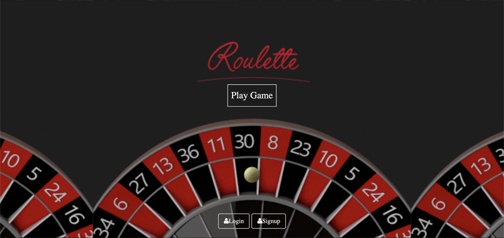

# Roulette-App
Gamble! is a roulette app which utilizes JS, Node.js, MongoDB, HTML5 and CSS to provide patrons and casino employees with a sleek, easy to use interface to keep track of finances when playing roulette.

This app was built with all of Team Moses (Nyah, Asiah, Vanessa, Zahmir, Eric, Finesse) as well as a number of different Resilient Codersd Mentors. The Starter code came from an authentication app built by Leon Noel.
